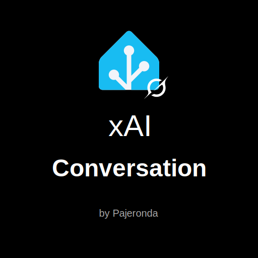
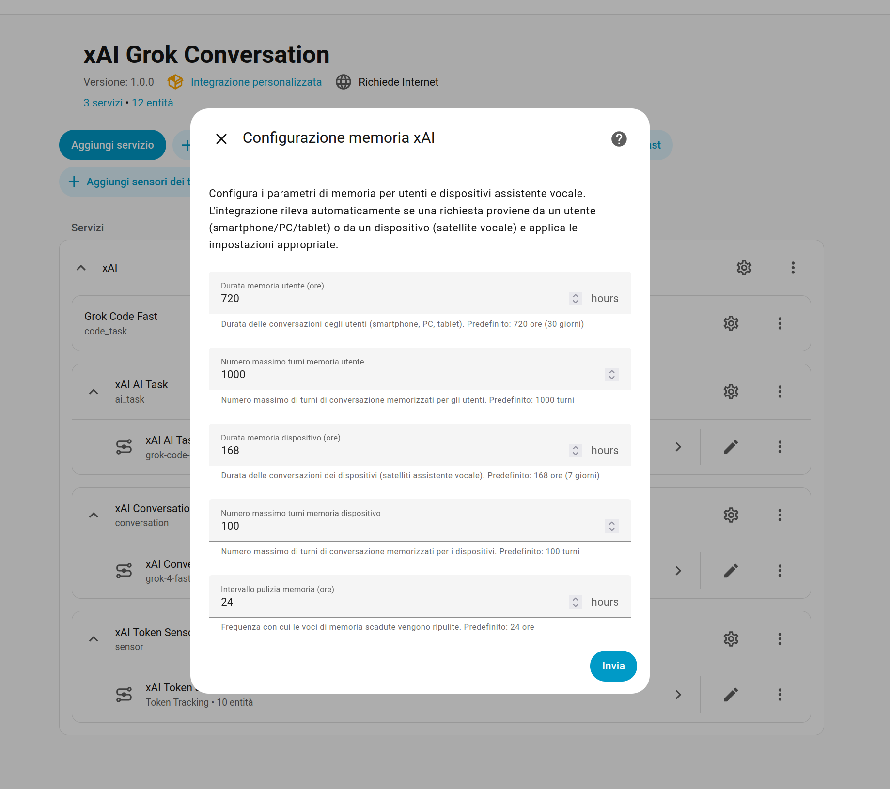
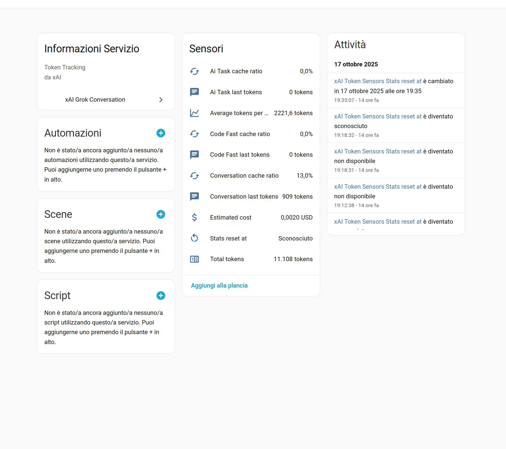
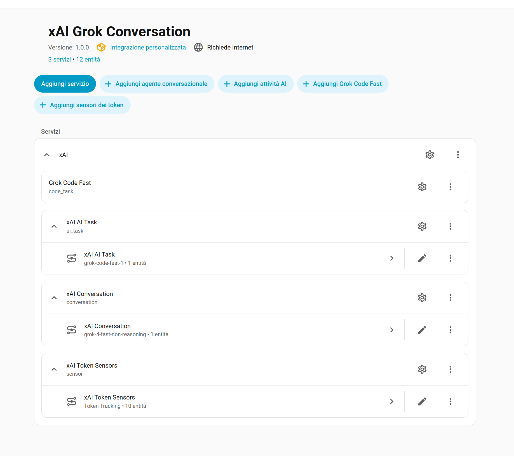

  <h1>xAI Conversation</h1>

  
  
  <b>A custom Home Assistant integration that brings xAI Grok AI to your smart home.</b>

  
  
  
  

## Key Features
### ⚙️ xAI Python SDK: 
- This component uses [xAI Python SDK](https://github.com/xai-org/xai-sdk-python)

### 💬 Intelligent Conversation Agent
- **Two Operating Modes**:
  - **Intelligent Pipeline**: Grok delegates device commands using Home Assistant's **conversation/process** service
  - **Tools Mode**: Direct access to HA tools via tool calling (Home Assistant's standard LLM API)
  - **Conversation Style**: Grok follows your conversation style
  - **Conversation Continuity**: Chat continues seamlessly across any device configured with your user account (Smartphone, Tablet, PC, etc.)

  

  

### 💬 Conversation Memory Management
- **Server-side**: Persistent conversations managed by xAI (saves tokens and costs)
- **Client-side**: Conversations managed with local history (Home Assistant standard, more expensive)
- **Separate Configuration** for **users** and **Assist** satellite devices
- **Chat History** synchronizable across user devices in the **grok-code-fast-card** service

  

### ⚙️ AI Task Service
Integration with Home Assistant's AI Task service for:
- Intelligent automations
- Scripts with dynamic logic
- Context-aware actions based on home state
- Image generation (automatically uses the `grok-2-image` model)

### 💻 Grok Code Fast
Dedicated service for Home Assistant code generation:
- YAML for automations and configurations
- Jinja2 templates
- Custom Python scripts
- **Lovelace Card** with integrated editor and interactive chat

### 📊 Token and Cost Monitoring
Detailed sensors that track:
- Tokens per service (Conversation, AI Task, Code Fast)
- Cache hit ratio (server-side memory efficiency)
- Real-time cost estimates
- Statistics per model used

  

---

  

## Installation

### Via HACS (Recommended)

Click this badge to install **xAI Conversation** via **HACS**

Click this badge after restart Home Assistant to configure **xAI Conversation**

**Manual HACS**
1. Open **HACS** in Home Assistant
2. Go to **Integrations** → **Menu (⋮)** → **Custom repositories**
3. Add: `https://github.com/pajeronda/xai_conversation`
4. Category: **Integration**
5. Search for "**xAI Grok Conversation**" and click **Download**
6. Restart Home Assistant

### Manual Installation
1. Download the latest release of [xAI Grok Conversation](https://github.com/pajeronda/xai_conversation/releases)
   (alternatively, download the zip from the "<> code" badge at the top of this page)
2. Extract and copy the `xai_conversation` folder to `config/custom_components/`
3. Restart Home Assistant

## Grok Code Fast Lovelace Card

The `grok-code-fast-card` custom card offers:
- 💬 Interactive chat with Grok
- 📝 Code editor with syntax highlighting
- 📋 Quick copy of generated code
- 🔄 Automatic synchronization across devices
- 📱 Responsive layout (desktop/mobile)

### Via HACS (Recommended)

Click this badge to install **Grok code fast card** via **HACS** (recommended)

**Manual**
- Follow the instructions on the GitHub page [Grok code fast card](https://github.com/pajeronda/grok-code-fast-card/)

## Configuration

### 1. Get xAI API Key
1. Go to [console.x.ai](https://console.x.ai)
2. Create an account or log in
3. Generate a new API key
4. Configure the new API Key

### 2. Add the Integration
1. Go to **Settings** → **Devices & Services** → **Add Integration**
2. Search for "**xAI Grok Conversation**"
3. Enter your xAI API key
4. Configure initial preferences (e.g., name and web search)

### 3. Set as Default Assistant
1. Go to **Settings** → **Voice assistants**
2. Configure a new voice assistant
3. Choose a name and select "**xAI Conversation**" from the conversation agents
4. Complete the configuration with your desired parameters

## Usage Examples

### Conversation Agent
- "Turn on the living room lights"
- "What's the temperature in the kitchen?"

### Grok Code Fast
- "Create an automation that turns off the lights at 11 PM"
- "Generate a Jinja2 template to display energy consumption"

## Supported Models

| Model | Recommended Use | Notes |
|---------|------------------|------|
| `grok-4` | Complex reasoning | Slower, more accurate and expensive |
| `grok-4-fast` | Complex reasoning | Balanced speed/quality/cost |
| `grok-4-fast-non-reasoning` | Great for Home Assistant | Fast, economical |
| `grok-3` | Complex reasoning | Slower and more expensive |
| `grok-3-mini` | Great for Home Assistant | Balanced speed/cost |
| `grok-code-fast-1` | Code generation | Optimized for YAML/Python/Jinja2 |
| `grok-2-image` | Image generation | Optimized for images |

## Pricing and Tokens for Default Models

The integration automatically tracks costs based on xAI pricing (per 1M tokens) updated as of 10/15/2025:

| Model | Input | Cached Input | Output |
|---------|-------|--------------|--------|
| grok-4-fast-non-reasoning (default) | $0.50 | $0.05 | $1.50 |
| grok-code-fast-1 (default) | $0.20 | $0.02 | $1.50 |

Available sensors:
- `sensor.<name>_total_tokens`
- `sensor.<name>_estimated_cost`
- `sensor.<name>_conversation_cache_ratio`
- `sensor.<name>_conversation_last_tokens`

## Troubleshooting

### Integration doesn't appear
- Verify the folder is in `custom_components/xai_conversation/`
- Restart Home Assistant
- Check the logs: **Settings** → **System** → **Logs**

### API Key errors on [console.x.ai](https://console.x.ai)
- Verify the key is correct
- Check usage limits in your xAI account
- Ensure the key has sufficient permissions

### Assistant doesn't respond
- Verify the agent is selected in **Settings** → **Voice assistants**
- Check that device control is enabled (if you want device control)
- Check the Home Assistant log

### Low cache ratio
- Normal in initial conversations ("cold" cache)
- Increases with repeated conversations on the same topic
- Server-side memory (`store_messages=True`) improves cache

## Technical Documentation

(Work in progress ...)
For developers and contributions: consult [xxx.md](xxx.md) for:
- System architecture
- Development guide
- Module and class structure
- Internal APIs

## Contributing

Contributions welcome! Please:
1. Fork the repository
2. Create a branch for your feature (`git checkout -b feature/AmazingFeature`)
3. Commit your changes (`git commit -m 'Add some AmazingFeature'`)
4. Push to the branch (`git push origin feature/AmazingFeature`)
5. Open a Pull Request

## Support

- 🐛 **Bug Report**: [GitHub Issues](https://github.com/pajeronda/xai_conversation/issues)
- 💡 **Feature Request**: [GitHub Issues](https://github.com/pajeronda/xai_conversation/issues)
- 📖 **Documentation**: [Wiki](https://github.com/pajeronda/xai_conversation/wiki) _(coming soon)_

## Credits

Developed by [@pajeronda](https://github.com/pajeronda)

Integration based on:
- [xAI SDK](https://github.com/xai-org/xai-sdk-python)
- [Home Assistant](https://www.home-assistant.io/)

## License

This project is released under the MIT License. See [LICENSE](LICENSE) for details.

---

## Legal Notes

- **API Usage**: This integration requires an active xAI account and a valid API key. Use of the xAI API is subject to [xAI's terms of service](https://x.ai/legal/).

- **Trademarks**: xAI, Grok, and related logos are registered trademarks of xAI Corp. This project is an **unofficial** integration developed by [@pajeronda](https://github.com/pajeronda) and is not affiliated with, sponsored by, or endorsed by xAI Corp.
